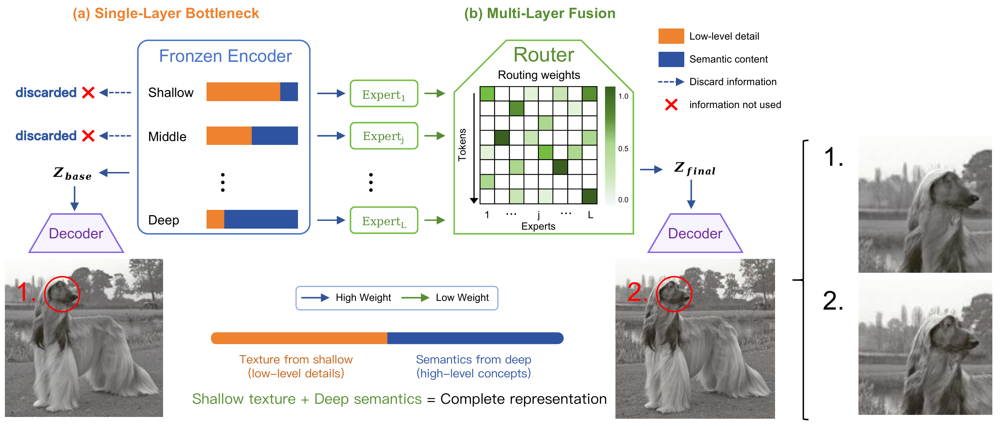
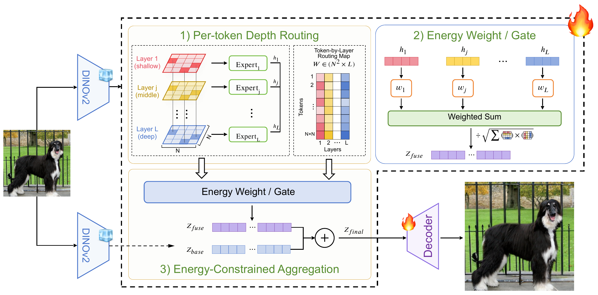
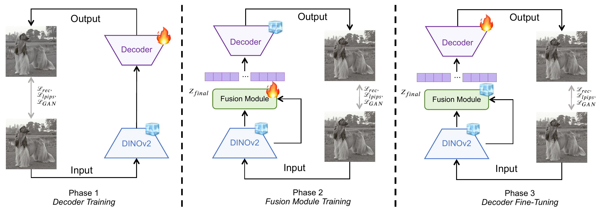
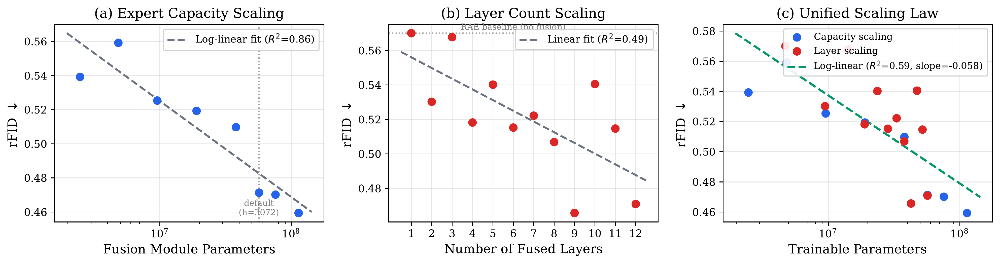

<div align="center">

# Beyond the Last Layer: Multi-Layer Representation Fusion for Visual Tokenization

**arXiv Paper:** [](https://arxiv.org/abs/2605.10780) &nbsp;&nbsp;&nbsp; **Code:** [](https://github.com/zhuzil/DRoRAE)

</div>

---

## News
- **[2026/05]** We are excited to release **DRoRAE**, a lightweight multi-layer fusion module that significantly improves reconstruction quality of visual tokenizers while fully preserving generation capability. Multi-layer fusion further introduces *representation richness* as a new, predictably scalable dimension for visual tokenizers analogous to vocabulary size in NLP, where richer representations yield continuous, log-linear improvements for downstream tasks.

<div align="center">

</div>

## Introduction

- Representation autoencoders that reuse frozen pretrained vision encoders (e.g., DINOv2) as visual tokenizers have achieved strong reconstruction and generation quality. However, existing methods universally extract features from only the last encoder layer, discarding the rich hierarchical information distributed across intermediate layers.
- We show that low-level visual details survive in the last layer merely as attenuated residuals after multiple layers of semantic abstraction, and that explicitly fusing multi-layer features** can substantially recover this lost information.
- We propose **DRoRAE** (**D**epth-**Ro**uted **R**epresentation **A**uto**E**ncoder), a lightweight fusion module (~29M parameters) that adaptively aggregates all encoder layers via energy-constrained routing and incremental correction, producing an enriched latent compatible with a frozen pretrained decoder.
- A **three-phase decoupled training strategy** first learns the fusion under the implicit distributional constraint of the frozen decoder, then fine-tunes the decoder to fully exploit the enriched representation.
- On ImageNet-256, DRoRAE reduces **rFID from 0.57 to 0.29** and improves generation **FID from 1.74 to 1.65** (with AutoGuidance), with gains also transferring to text-to-image synthesis.
- We uncover a **log-linear scaling law** ($R^2{=}0.86$) between fusion capacity and reconstruction quality, identifying *representation richness* as a new, predictably scalable dimension for visual tokenizers analogous to vocabulary size in NLP.


## Method Overview

DRoRAE inserts a lightweight depth-routed fusion module between the frozen DINOv2 backbone and the decoder. The module consists of three key components:

1. **Per-token Depth Routing**: Layer-wise expert MLPs project heterogeneous features onto a common scale, and a learned router assigns per-token aggregation weights across all backbone layers.
2. **Energy-Constrained Aggregation**: Unlike standard softmax routing, our energy-constrained formulation permits negative weights, allowing the router to actively suppress detrimental layer contributions.
3. **Incremental Correction**: The fused representation is injected as a bounded perturbation to the original last-layer output, preserving decoder compatibility.

<div align="center">

</div>

## Training Strategy

We adopt a three-phase decoupled training strategy:

- **Phase 1 — Decoder Training**: Standard RAE training. The decoder learns to reconstruct images from last-layer features with the backbone frozen.
- **Phase 2 — Fusion Module Training**: Both backbone and decoder are frozen. Only the fusion module (~29M params) is trained, with the frozen decoder acting as an implicit distributional constraint.
- **Phase 3 — Decoder Fine-Tuning**: The decoder is unfrozen and co-adapts with the enriched fused latent, fully exploiting the richer representation.

<div align="center">

</div>

## Main Results

### Reconstruction & Class-Conditional Generation (ImageNet-256)

| Method | rFID ↓ | PSNR ↑ | LPIPS ↓ | SSIM ↑ | gFID w/ AG ↓ |
|:---|:---:|:---:|:---:|:---:|:---:|
| SD-VAE | 0.61 | 26.9 | 0.130 | 0.736 | 2.27 |
| VA-VAE | 0.27 | 27.7 | 0.097 | 0.779 | 3.63 |
| RAE | 0.57 | 18.8 | 0.256 | 0.483 | 1.74 |
| RPiAE | 0.50 | 21.3 | 0.216 | 0.525 | 1.51 |
| **DRoRAE (Phase 2)** | 0.47 | 21.79 | 0.195 | 0.583 | 1.70 |
| **DRoRAE (Full)** | **0.29** | **24.32** | **0.134** | **0.701** | **1.65** |

### Qualitative Reconstruction Comparison

<div align="center">

</div>

## Scaling Law

We discover a log-linear scaling law between fusion module capacity and reconstruction quality, establishing **representation richness** as a predictably scalable dimension for visual tokenizers:

- **Expert capacity scaling**: Increasing the expert hidden dimension yields log-linear rFID improvement ($R^2=0.86$).
- **Layer count scaling**: Adding more fused layers yields consistent gains with no saturation.
- **Unified scaling law**: Both axes collapse onto a single log-linear trend when plotted against total trainable parameters.

<div align="center">

</div>

## Generation Samples

Class-conditional generation samples on ImageNet-256 using DiT with DRoRAE tokenizer and AutoGuidance:

<div align="center">

</div>

## Citation

If you find our work useful, please consider citing our paper:
```bibtex
@misc{zhu2026drorae,
      title={Beyond the Last Layer: Multi-Layer Representation Fusion for Visual Tokenization}, 
      author={Xuanyu Zhu and Yan Bai and Yang Shi and Yihang Lou and Yuanxing Zhang and Jing Jin and Yuan Zhou},
      year={2026},
      eprint={2605.10780},
      archivePrefix={arXiv},
      primaryClass={cs.CV},
      url={https://arxiv.org/abs/2605.10780}, 
}
```
